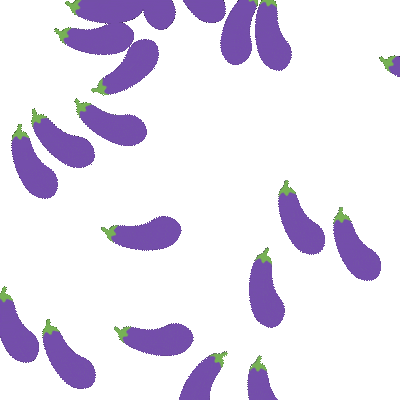
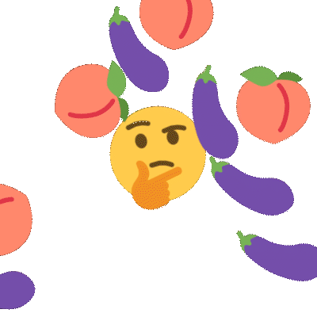
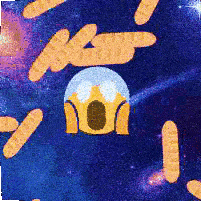

# yeetgif

Composable GIF effects CLI, with reasonable defaults. Made for custom Slack/Discord emoji :)


- [Get it](#get-it)
    - [Alternative 1: `go get`](#alternative-1-go-get)
    - [Alternative 2: just download the binary](#alternative-2-just-download-the-binary)
    - [Alternative 3: docker](#alternative-3-docker)
- [Use it](#use-it)
- [Hall of Fame](#hall-of-fame)
- [Usage](#usage)
    - [Conventions & tips](#conventions--tips)
    - [roll](#roll)
    - [wobble](#wobble)
    - [pulse](#pulse)
    - [zoom](#zoom)
    - [shake](#shake)
    - [woke](#woke)
    - [fried](#fried)
    - [hue](#hue)
    - [tint](#tint)
    - [resize](#resize)
    - [crop](#crop)
    - [optimize](#optimize)
    - [compose](#compose)
    - [crowd](#crowd)
    - [erase](#erase)
    - [chop](#chop)
    - [text](#text)
    - [emoji](#emoji)
    - [npc](#npc)
    - [rain](#rain)
    - [cat](#cat)
    - [meta](#meta)
- [Licensing](#licensing)

## Get it

### Alternative 1: `go get`

```sh
go get -u github.com/sgreben/yeetgif/cmd/gif
```

### Alternative 2: just download the binary

Either from [the releases page](https://github.com/sgreben/yeetgif/releases/latest), or from the shell:

```sh
# Linux
curl -L https://github.com/sgreben/yeetgif/releases/download/1.23.4/gif_1.23.4_linux_x86_64.tar.gz | tar xz

# OS X
curl -L https://github.com/sgreben/yeetgif/releases/download/1.23.4/gif_1.23.4_osx_x86_64.tar.gz | tar xz

# Windows
curl -LO https://github.com/sgreben/yeetgif/releases/download/1.23.4/gif_1.23.4_windows_x86_64.zip
unzip gif_1.23.4_windows_x86_64.zip
```

**NOTE**: To use the `optimize` command, you'll also need the [`giflossy`](https://github.com/kornelski/giflossy) fork of `gifsicle` installed:

```sh
brew install giflossy
```

You'll likely also want to have the binary in your `$PATH`. You can achieve this by adding this to your .bashrc (or .zshrc, ...):

```sh
export PATH=<directory-containing-the-gif-binary>:$PATH
```

### Alternative 3: docker

```sh
docker pull quay.io/sergey_grebenshchikov/yeetgif
docker tag quay.io/sergey_grebenshchikov/yeetgif gif # (optional)
```

## Use it

```sh
<doc/yeet.png gif fried | gif wobble  >doc/yeet.gif
```


```sh
gif emoji aubergine | gif wobble >doc/eggplant_wobble.gif
```


## Hall of Fame

Post a GIF made using yeetgif with either the

- [`#yeetgif` Twitter hashtag](https://twitter.com/hashtag/yeetgif?f=tweets)
- and/or the [`#yeetgif` Giphy hashtag](https://giphy.com/search/yeetgif-stickers)
- and/or the [`#yeetgif` Imgur hashtag](https://imgur.com/t/yeetgif)

~~Best~~ Most utterly demented ones end up below!

> No entries yet. Be the first :)

## Usage

```text

Usage: gif [OPTIONS] COMMAND [arg...]

                     
Options:             
  -n                 Duplicate a single input image this many times (default 30)
  -q, --quiet        Disable all log output (stderr)
  -p, --pad          Pad images (default true)
      --write-meta   Write command line options into output GIF metadata (default true)
  -r, --raw          Raw (lossless, *not* GIF) image output, for re-piping to yeetgif
  -d, --delay-ms     Frame delay in milliseconds (default [25])
                     
Commands:            
  roll               (☭ ͜ʖ ☭)
  wobble             🍆( ͡° ͜ʖ ͡°)🍆
  pulse              ( ͡◉ ͜ʖ ͡◉)
  zoom               (⌐▀͡ ̯ʖ▀)
  shake              ˵(˵ ͡⚆ ͜ʖ ͡⚆˵)˵
  woke               💯  W O K E F L A R E S ( ͡ 🅱️ ͜ʖ ͡ 🅱️ ) 💯
  fried              fr͍͈i̗̟̲̻e͕̗d̬ m̷͔͊e̶̪̿m̷̙̈́é̵̤s̷̺͒
  hue                ( ͡☆ ͜ʖ ͡☆)
  tint               🎨༼ຈل͜ຈ༽
  resize             (° ͜ʖ°)¯\_( ͡☉ ͜ʖ ͡☉)_/¯
  crop               ┬┴┬┴┤ ͜ʖ ͡°)
  optimize           👌( ͡ᵔ ͜ʖ ͡ᵔ )👌
  compose            (ﾉ ͡° ͜ʖ ͡°)ﾉ*:･ﾟ✧
  crowd              (⟃ ͜ʖ ⟄) ͜ʖ ͡°)( ° ͜ʖ( ° ͜ʖ °)
  erase              ( ͡° ͜ʖ ͡°)=ε/̵͇̿̿/'̿̿ ̿ ̿ ̿ ̿ ̿
  chop               ✂️( ͡°Ĺ̯ ͡° )🔪
  text               🅰️乁(˵ ͡☉ ͜ʖ ͡☉˵)┌🅱️
  emoji              ╰( ͡° ͜ʖ ͡° )つ──☆*🤔
  npc                •L•
  rain               。°。°( ͡° ͜ʖ ͡ °)°。°。°
  scan               ( ͡ ⿳ ͜ʖ ͡ ⿳ )
  noise              ·͙*̩̩͙˚̩̥̩̥( ͡▓▒ ͜ʖ ͡█░ )*̩̩͙:͙
  cat                /ᐠ｡ꞈ｡ᐟ\
  meta               (🧠 ͡ಠ ʖ̯ ͡ಠ)┌
                     
Run 'gif COMMAND --help' for more information on a command.
```

### Conventions & tips

- To find out how a given example was made, try running `gif meta show` on it (e.g. `<yeet.gif gif meta show -p` will print the shell pipe of gif effects used to create `yeet.gif`).
- Use the `--raw` (`-r`) option for intermediate pipe steps -- this is faster than re-encoding as GIF every time. Also it's lossless.
- Options with bracketed default values (e.g. `--noise` of [`fried`](#fried)) can take comma-separated values - the points will be spread over the animation length, with intermediate values linearly interpolated.
- To figure out what a parameter does, try out some values around its default value, as well as much larger/smaller ones.
- To reduce GIF size, try specifying a smaller number of duplicates for static images (e.g. `gif -n 20`), `gif optimize`, and dropping frames `gif chop drop every <N>`.

### roll


```text

Usage: gif roll [OPTIONS]

(☭ ͜ʖ ☭)
                      
Options:              
  -r, --revolutions   (default 1)
  -s, --scale         (default 1)
  -p, --phase         (default 0)
  -c, --crop-scale    (default 1)
```

### wobble


```text

Usage: gif wobble [OPTIONS] [CUSTOM]

🍆( ͡° ͜ʖ ͡°)🍆
                    
Arguments:          
  CUSTOM            comma-separated angles (°), e.g. 0,10,0,60,0 (default [])
                    
Options:            
  -f, --frequency   (default 1)
  -a, --amplitude   (default 20)
  -p, --phase       (default 0)
  -t, --type        one of [sine snap saw sticky] (default sine)
      --custom      (deprecated) (default [])
```

### pulse


```text

Usage: gif pulse [OPTIONS] [ZOOM_LEVELS_CSV]

( ͡◉ ͜ʖ ͡◉)
                    
Arguments:          
  ZOOM_LEVELS_CSV   (default [])
                    
Options:            
  -0, --from        (default 0.9)
  -1, --to          (default 1)
  -f, --frequency   (default 1)
  -p, --phase       (default 0)
```

### zoom


```text

Usage: gif zoom [OPTIONS] [ZOOM_LEVELS_CSV]

(⌐▀͡ ̯ʖ▀)
                    
Arguments:          
  ZOOM_LEVELS_CSV   e.g. 1.0,1.5 to zoom from 100% to 150% (default [])
```

### shake


```text

Usage: gif shake [OPTIONS]

˵(˵ ͡⚆ ͜ʖ ͡⚆˵)˵
                    
Options:            
  -f, --frequency   (default [1])
  -a, --amplitude   (default [7])
  -r, --random      🌀 (default [0.75])
```

### woke


```text

Usage: gif woke [OPTIONS] POINTS

💯  W O K E F L A R E S ( ͡ 🅱️ ͜ʖ ͡ 🅱️ ) 💯
                          
Arguments:                
  POINTS                  flare locations, JSON, e.g. "[[123,456],[-100,23]]" (default &[])
                          
Options:                  
  -c, --clip              clip flares to image alpha (default true)
  -t, --type              (default full)
  -s, --scale             (default 0.9)
  -u, --hue               (default 0.8)
  -l, --lightness         (default 1)
  -a, --alpha             (default 0.8)
  -p, --alpha-pow         (default 2)
      --alpha-threshold   (default 0.15)
  -r, --random            🌀 (default 0.5)
```

### fried


```text

Usage: gif fried [OPTIONS]

fr͍͈i̗̟̲̻e͕̗d̬ m̷͔͊e̶̪̿m̷̙̈́é̵̤s̷̺͒
                     
Options:             
      --clip         (default true)
  -w, --walk         🌀 (default 10)
  -i, --iterations   (default 1)
  -a                 🅰️ (default [0.33])
  -b                 🅱️ (default [0.2])
  -c                 🆑 (default [0.9])
  -n, --noise        🌀️ (default [1])
      --noise1       🌀️ (default [0.02])
      --noise2       🌀️ (default [0.5])
      --noise3       🌀 (default [0.1])
  -j, --jpeg         [0,100] (default [84])
  -u, --saturation   (default [3])
  -o, --contrast     (default [6])
  -t, --tint         tint (default [0.4])
```

### hue


```text

Usage: gif hue [OPTIONS] [HUE_OFFSETS_CSV]

( ͡☆ ͜ʖ ͡☆)
                    
Arguments:          
  HUE_OFFSETS_CSV   (default [])
                    
Options:            
  -f, --frequency   (default 1)
  -a, --amplitude   (default 0.1)
  -x                (default [1])
  -y                (default [1])
  -m, --mode        one of [mul add sub pow sin] (default add)
```

### tint


```text

Usage: gif tint [OPTIONS] [TINT_HUE_CSV]

🎨༼ຈل͜ຈ༽
                    
Arguments:          
  TINT_HUE_CSV      (default [])
                    
Options:            
  -f, --frequency   (default 1)
  -a, --amplitude   (default 0.95)
  -x                (default [1])
  -y                (default [1])
  -m, --mode        one of [mul add sub pow sin] (default add)
  -c, --center      (default 0.2183000524405257)
```

### resize

```text

Usage: gif resize [OPTIONS]

(° ͜ʖ°)¯\_( ͡☉ ͜ʖ ͡☉)_/¯
                 
Options:         
  -s, --scale    (default 1)
  -x, --width    width (pixels) (default 0)
  -y, --height   height (pixels) (default 0)
```

### crop

```text

Usage: gif crop [OPTIONS]

┬┴┬┴┤ ͜ʖ ͡°)
                    
Options:            
  -t, --threshold   (default 0)
```

### optimize

```text

Usage: gif optimize [OPTIONS]

👌( ͡ᵔ ͜ʖ ͡ᵔ )👌
                    
Options:            
      --kb          target file size (KB) (default 128)
  -n, --no-resize   don't resize the image
  -x, --width       target width (pixels) (default 0)
  -y, --height      target height (pixels) (default 0)
```

### compose


```text

Usage: gif compose [OPTIONS] INPUT

(ﾉ ͡° ͜ʖ ͡°)ﾉ*:･ﾟ✧
                   
Arguments:         
  INPUT            
                   
Options:           
  -x               (default [0])
  -y               (default [0])
  -z, --z-order    one of [under over] (default over)
  -p, --position   one of [center left right top bottom abs] (default center)
  -s, --scale      (default [1])
```

### crowd


```text

Usage: gif crowd [OPTIONS]

(⟃ ͜ʖ ⟄) ͜ʖ ͡°)( ° ͜ʖ( ° ͜ʖ °)
                 
Options:         
  -n             crowd size (default 3)
      --flip     🌀 flip (default true)
  -x             🌀 x (default 0.5)
  -y             🌀 y (default 0.25)
  -s, --scale    🌀 [0.0,1.0] (default 0.25)
  -r, --rotate   🌀 [0.0,1.0] (default 0.1)
  -a, --alpha    🌀 [0.0,1.0] (default 0)
  -o, --offset   🌀 [0.0,1.0] (default 1)
```

### erase


```text

Usage: gif erase [OPTIONS]

( ͡° ͜ʖ ͡°)=ε/̵͇̿̿/'̿̿ ̿ ̿ ̿ ̿ ̿
                    
Options:            
  -x, --sample-x    (default 3)
  -y, --sample-y    (default 3)
  -t, --tolerance   (default 0.2)
  -u                (default 1)
  -s                (default 0.5)
  -l                (default 1)
```

### chop

```text

Usage: gif chop COMMAND [arg...]

✂️( ͡°Ĺ̯ ͡° )🔪
                   
Commands:          
  shuffle          
  dup, duplicate   
  drop             
  rev, reverse     
                   
Run 'gif chop COMMAND --help' for more information on a command.
```

### text


> woke | text | fried

```text

Usage: gif text [OPTIONS] [TEXT]

🅰️乁(˵ ͡☉ ͜ʖ ͡☉˵)┌🅱️
                             
Arguments:                   
  TEXT                       (default "#yeetgif")
                             
Options:                     
  -a, --background-alpha     (default 0.7)
  -s, --font-size            (default 18.5)
  -y, --text-y               (default 0.3)
  -p, --background-padding   (default 3)
```

### emoji


> emoji | compose <(emoji) | compose <(emoji) | wobble | fried

```text

Usage: gif emoji [OPTIONS] EMOJI...

╰( ͡° ͜ʖ ͡° )つ──☆*🤔
                     
Arguments:           
  EMOJI              one or more glob expressions
                     
Options:             
  -e, --exact        match the query exactly
  -p, --pipe         overlay the emoji over input images (instead of just creating one)
  -l, --list-only    just list matches
  -s, --size         (default [128])
  -a, --pipe-alpha   (default [1])
```

### npc


```text

Usage: gif npc [OPTIONS]

•L•
                         
Options:                 
  -x                     (default [0.5])
  -y                     (default [0.5])
      --bg               one of [solid blur] (default solid)
      --bg-blur-radius   (specifying this implies --bg=blur) (default 10)
  -s, --scale            (default [1])
      --scale-x          (default [1])
      --scale-y          (default [1])
      --eye-scale        (default [1])
      --nose-scale       (default [1])
      --mouth-scale-x    (default [1])
      --mouth-scale-y    (default [0])
  -r, --angle            (default [0])
  -a, --alpha            (default [1])
```

### rain



> emoji | rain



> emoji | roll | rain <(emoji) <(emoji)



> emoji | pulse | rain <(emoji) | compose | fried

```text

Usage: gif rain [OPTIONS] [INPUT...] [OPTIONS]

。°。°( ͡° ͜ʖ ͡ °)°。°。°
                                   
Arguments:                         
  INPUT                            
                                   
Options:                           
  -d, --density                    (default 0.75)
  -b, --bounciness                 (default [0.3])
  -g, --gravity                    (default 900)
  -s, --size                       (default 400)
  -a, --bounds-alpha-threshold     (default 0.0625)
  -v, --initial-linear-velocity    (default 300)
  -l, --animation-length-factor    (default 1)
  -x, --static-x                   (default 0.5)
  -y, --static-y                   (default 0.5)
      --wrap-max-overlap           (default 48)
      --wrap-max-overlap-frames    (default 24)
      --initial-angular-velocity   (default 2)
      --bounds-points              (default 16)
```

### cat

```text

Usage: gif cat [INPUT...]

/ᐠ｡ꞈ｡ᐟ\
               
Arguments:     
  INPUT        <filename>
```

### meta


```sh
$ <doc/yeet.gif gif meta show

[2018-10-05T13:08:57+02:00] gif fried
[2018-10-05T13:08:58+02:00] gif wobble
[2018-10-05T13:08:58+02:00] gif crop
[2018-10-05T13:08:58+02:00] gif optimize -x 0

$ <doc/yeet.gif gif meta show -p

gif fried | gif wobble | gif crop | gif optimize -x 0

$ <doc/yeet.gif gif meta show --raw

{"appName":"gif","timestamp":"2018-10-05T13:08:57+02:00","args":["fried"],"version":"1.0.0-244bcd73467a0979cb872f0e90ba8a69d4764410"}
{"appName":"gif","timestamp":"2018-10-05T13:08:58+02:00","args":["wobble"],"version":"1.0.0-244bcd73467a0979cb872f0e90ba8a69d4764410"}
{"appName":"gif","timestamp":"2018-10-05T13:08:58+02:00","args":["crop"],"version":"1.0.0-244bcd73467a0979cb872f0e90ba8a69d4764410"}
{"appName":"gif","timestamp":"2018-10-05T13:08:58+02:00","args":["optimize","-x","0"],"version":"1.0.0-244bcd73467a0979cb872f0e90ba8a69d4764410"}
```

```text

Usage: gif meta COMMAND [arg...]

(🧠 ͡ಠ ʖ̯ ͡ಠ)┌
               
Commands:      
  show         show 🧠
  add          add 🧠
  clear        remove 🧠
               
Run 'gif meta COMMAND --help' for more information on a command.
```

## Licensing

- `yeetgif` itself & any original code: [MIT License](LICENSE)
- [Modified copy](pkg/imaging) of `github.com/disintegration/imaging`: [MIT License](pkg/imaging/LICENSE)
- [Modified copy](pkg/ggtext) of `github.com/fogleman/gg`: [MIT License](pkg/ggtext/LICENSE.md)
- [Roboto Regular TrueType Font](pkg/gifstatic/roboto.go): [Apache License 2.0](pkg/gifstatic/roboto.go-LICENSE)
- [Twemoji](pkg/gifstatic/emoji_twitter.go) by [Twitter](https://twemoji.twitter.com): [CC BY 4.0](https://creativecommons.org/licenses/by/4.0/)
- [Modified portion](pkg/box2d) of `github.com/ByteArena/box2d` by [ByteArena (Go port)](github.com/ByteArena/box2d)/[Erin Catto (C++ original)](http://www.box2d.org): [MIT License](pkg/box2d/LICENSE.md)
