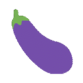

# yeetgif

Composable GIF effects CLI, with reasonable defaults. Made for custom Slack/Discord emoji :)


<!-- TOC -->

- [Get it](#get-it)
    - [Alternative 1: `go get`](#alternative-1-go-get)
    - [Alternative 2: just download the binary](#alternative-2-just-download-the-binary)
    - [Alternative 3: docker](#alternative-3-docker)
- [Use it](#use-it)
- [Hall of Fame](#hall-of-fame)
- [Usage](#usage)
    - [roll](#roll)
    - [wobble](#wobble)
    - [pulse](#pulse)
    - [zoom](#zoom)
    - [shake](#shake)
    - [woke](#woke)
    - [fried](#fried)
    - [hue](#hue)
    - [tint](#tint)
    - [resize](#resize)
    - [crop](#crop)
    - [optimize](#optimize)
    - [compose](#compose)
    - [crowd](#crowd)
    - [erase](#erase)
    - [chop](#chop)
    - [text](#text)
    - [emoji](#emoji)
    - [npc](#npc)
    - [nop](#nop)
    - [meta](#meta)
- [Licensing](#licensing)

<!-- /TOC -->

## Get it

### Alternative 1: `go get`

```sh
go get -u github.com/sgreben/yeetgif/cmd/gif
```

### Alternative 2: just download the binary

Either from [the releases page](https://github.com/sgreben/yeetgif/releases/latest), or from the shell:

```sh
# Linux
curl -L https://github.com/sgreben/yeetgif/releases/download/${VERSION}/gif_${VERSION}_linux_x86_64.tar.gz | tar xz

# OS X
curl -L https://github.com/sgreben/yeetgif/releases/download/${VERSION}/gif_${VERSION}_osx_x86_64.tar.gz | tar xz

# Windows
curl -L https://github.com/sgreben/yeetgif/releases/download/${VERSION}/gif_${VERSION}_windows_x86_64.zip
unzip gif_${VERSION}_windows_x86_64.zip
```

**NOTE**: To use the `optimize` command, you'll also need the [`giflossy`](https://github.com/kornelski/giflossy) fork of `gifsicle` installed:

```sh
brew install giflossy
```

You'll likely also want to have the binary in your `$PATH`. You can achieve this by adding this to your .bashrc (or .zshrc, ...):

```sh
export PATH=<directory-containing-the-gif-binary>:$PATH
```

### Alternative 3: docker

```sh
docker pull quay.io/sergey_grebenshchikov/yeetgif
docker tag quay.io/sergey_grebenshchikov/yeetgif gif # (optional)
```

## Use it

```sh
<doc/yeet.png gif fried | gif wobble  >doc/yeet.gif
```


```sh
gif emoji aubergine | gif wobble >doc/eggplant_wobble.gif
```



## Hall of Fame

Tweet a GIF made using yeetgif with the [`#yeetgif` twitter hashtag](https://twitter.com/hashtag/yeetgif?f=tweets) and/or [`#yeetgif` giphy hashtag](https://giphy.com/search/yeetgif-stickers). Best ones end up below!

> No entries yet. Be the first :)

## Usage

```text
${USAGE}
```

### roll


```text
${USAGE_roll}
```

### wobble


```text
${USAGE_wobble}
```

### pulse


```text
${USAGE_pulse}
```

### zoom


```text
${USAGE_zoom}
```

### shake


```text
${USAGE_shake}
```

### woke


```text
${USAGE_woke}
```

### fried


```text
${USAGE_fried}
```

### hue


```text
${USAGE_hue}
```

### tint


```text
${USAGE_tint}
```

### resize

```text
${USAGE_resize}
```

### crop

```text
${USAGE_crop}
```

### optimize

```text
${USAGE_optimize}
```

### compose


```text
${USAGE_compose}
```

### crowd


```text
${USAGE_crowd}
```

### erase


```text
${USAGE_erase}
```

### chop

```text
${USAGE_chop}
```

### text


> woke | text | fried

```text
${USAGE_text}
```

### emoji


> emoji | compose <(emoji) | compose <(emoji) | wobble | fried

```text
${USAGE_emoji}
```

### npc


```text
${USAGE_npc}
```

### nop

```text
${USAGE_nop}
```

### meta


```sh
$ <doc/yeet.gif gif meta show

[2018-10-05T13:08:57+02:00] gif fried
[2018-10-05T13:08:58+02:00] gif wobble
[2018-10-05T13:08:58+02:00] gif crop
[2018-10-05T13:08:58+02:00] gif optimize -x 0
```

```text
${USAGE_meta}
```

## Licensing

- [Modified copy](pkg/imaging) of `github.com/disintegration/imaging`: [MIT License](pkg/imaging/LICENSE)
- `yeetgif` itself: [MIT License](LICENSE)
- [Roboto Regular TrueType Font](pkg/gifstatic/roboto.go): [Apache License 2.0](pkg/gifstatic/roboto.go-LICENSE)
- [Twemoji](pkg/gifstatic/emoji_twitter.go) by [Twitter](https://twemoji.twitter.com): [CC BY 4.0](https://creativecommons.org/licenses/by/4.0/)
